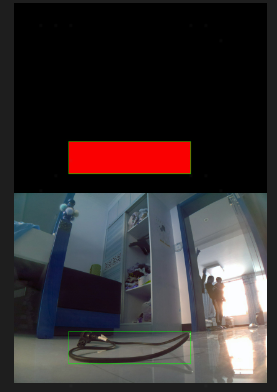
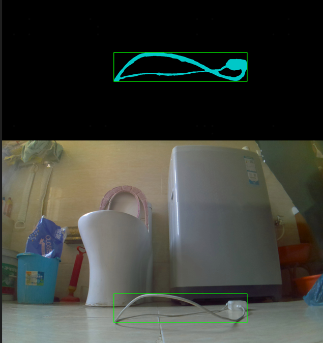
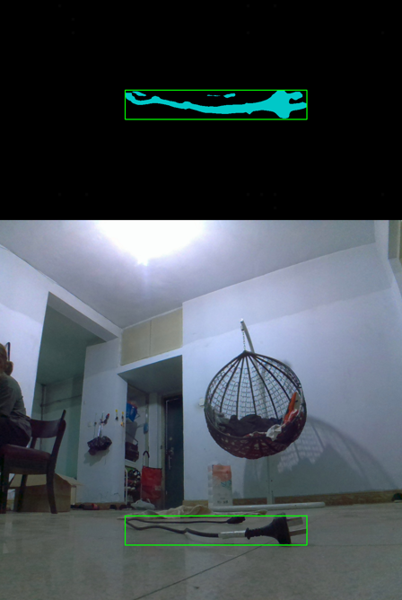
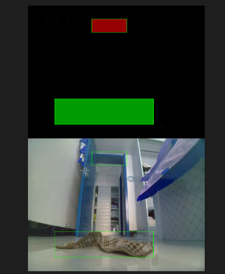
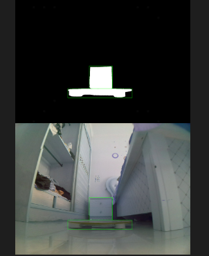

# get_get_ann_from_sam
用segment anything做下游任务数据预标注

segformer出predict mask 
ann-box; segformer-points; ann-box+segformer-points; segformer-box 4种形式prompt
结论: 
    1. ann-box表现比较稳定
    2. ann-box+segformer-points, 优化效果不稳定, 非常依赖point命中目标的质量 
    3. 毫无ann冷启动数据标注的话, 
        1. segformer-box形式比segformer-points形式好
    4. segformer出的mask怎么点中好的point?
        1. 目前的做法: 找area最大的那个连通域, 考虑pos,neg邻域内属性一致
            1. pos的邻域可小些, 因为已经是在area最大的连通域上找point了, 不至于random得太离谱到物体的边界上
            2. neg的领域设置大一些, 保证这个点大概率是准的(对于有缠绕的线, 这个neg点就很难找)
            3. 同时搭配一个10~20次的find_point_times: 找了find_point_times次还是没找到合适的pos,neg的话, 就不给point prompt了~  至少保底出一个ann-box的sam标注结果~ 
    5. [训测同步非常重要!!!segformer训练的image-size和待标注数据的size保持一致,效果好了些~]
        至少尽可能的让segformer出的mask准点吧~!!!

  

 