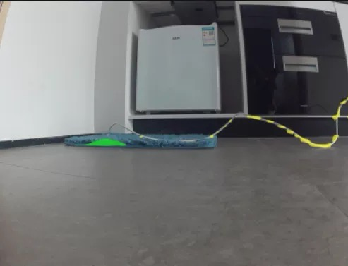

# sam的一些小细节:
  1. 官方demo给的效果非常好, 但我们用default最大sam模型直接inference image,
结果不见得和demo一样.
demo: 
default model:
可视化各个mask块发现, 黑色的那段弯曲线其实没检出的!
so: segformer+sam的voting结果, 尾部那段线也无.
segformer_res: 
segformer+sam voting res:

so, 需要调下参数:
新的segformer+sam voting res:
[当然放宽阈值带来了一些过检.]
可视化sam检出的快发现, 尾部的线有了:

sam的image input size暂时没有发现很明显的区别..

